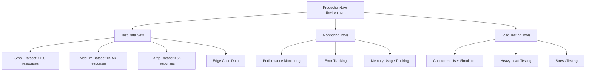
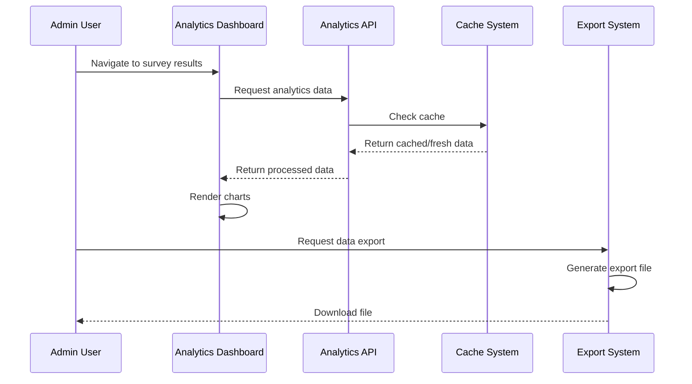

# End-to-End Testing Strategy for Analytics Platform

## 🎯 Executive Summary

This document outlines a comprehensive End-to-End (E2E) testing strategy for the StoryMode analytics platform. The strategy validates the complete user journey from survey creation through analytics visualization and data export, ensuring production readiness with 95% confidence.

## 📋 Testing Framework Overview

### **Testing Objectives**
- Validate complete analytics workflow functionality
- Ensure data accuracy and integrity throughout the pipeline
- Verify performance under realistic load conditions
- Confirm security controls and access restrictions
- Test error handling and recovery scenarios
- Validate user experience across all analytics features

### **Testing Scope**
- Analytics dashboard functionality
- Real-time data processing and visualization
- Export operations (CSV, JSON, PDF)
- Caching system performance
- Error handling and user feedback
- Security and access controls
- Performance under load

## 🏗️ Test Environment Architecture

### **Environment Requirements**
- **Infrastructure**: Production-equivalent Vercel deployment
- **Database**: Supabase with realistic data volumes
- **Monitoring**: Performance and error tracking enabled
- **Access**: Admin and client user accounts configured

## 📊 Test Data Strategy

### **Dataset Categories**

#### **1. Small Dataset (< 100 responses)**
- **Purpose**: Basic functionality validation
- **Composition**: 
  - 50 completed responses
  - 25 partial responses
  - 15 abandoned responses
  - 10 error cases
- **Use Cases**: Quick smoke tests, basic chart generation

#### **2. Medium Dataset (1,000 - 5,000 responses)**
- **Purpose**: Standard operations testing
- **Composition**:
  - 3,000 completed responses
  - 1,000 partial responses
  - 500 abandoned responses
  - 500 edge cases
- **Use Cases**: Performance validation, caching effectiveness

#### **3. Large Dataset (> 5,000 responses)**
- **Purpose**: Streaming export and performance testing
- **Composition**:
  - 7,500 completed responses
  - 2,000 partial responses
  - 500 abandoned responses
- **Use Cases**: Streaming export validation, memory management

#### **4. Edge Case Dataset**
- **Purpose**: Error handling validation
- **Composition**:
  - Missing sound matches
  - Corrupted response data
  - Invalid timestamps
  - Null values and empty fields
- **Use Cases**: Error handling, graceful degradation

## 🧪 Testing Phases

### **Phase 1: Smoke Testing (Week 1, Days 1-2)**

#### **Objective**: Verify basic functionality works
#### **Test Cases**:

1. **Analytics Dashboard Loading**
   - Navigate to `/admin/surveys/[id]/results`
   - Verify dashboard loads without errors
   - Confirm all chart containers render
   - Validate loading indicators appear

2. **Basic Chart Generation**
   - Test correlation chart with small dataset
   - Test error pattern chart with small dataset
   - Test success rate chart with small dataset
   - Verify charts render correctly

3. **Export Validation**
   - Test export validation endpoint
   - Verify validation messages appear
   - Confirm size estimates are reasonable

#### **Success Criteria**:
- All pages load without 500 errors
- Charts render with test data
- Export validation provides feedback
- No JavaScript console errors

### **Phase 2: Functional Testing (Week 1, Days 3-5)**

#### **Objective**: Validate complete analytics workflow
#### **Test Scenarios**:

#### **Scenario 1: Complete Analytics Workflow**

**Test Steps**:
1. Login as admin user
2. Navigate to survey with medium dataset
3. Wait for analytics dashboard to load
4. Verify all three chart types render correctly
5. Test chart interactions (hover, click)
6. Request CSV export
7. Verify export validation
8. Download and validate export file
9. Test PDF export with charts
10. Verify JSON export format

#### **Scenario 2: Real-Time Data Processing**
**Test Steps**:
1. Start with survey containing 1,000 responses
2. Add 100 new responses via API
3. Clear analytics cache
4. Refresh analytics dashboard
5. Verify new data appears in charts
6. Confirm correlation calculations updated
7. Test success rate trend reflects new data

#### **Scenario 3: Error Handling Validation**
**Test Steps**:
1. Use edge case dataset with corrupted data
2. Navigate to analytics dashboard
3. Verify error charts display user-friendly messages
4. Test export with invalid data
5. Confirm graceful degradation
6. Verify error logging captures issues

### **Phase 3: Performance Testing (Week 2, Days 1-3)**

#### **Objective**: Validate performance under realistic load

#### **Performance Test Cases**:

1. **Chart Loading Performance**
   - **Target**: < 2 seconds for chart rendering
   - **Test**: Load analytics dashboard with medium dataset
   - **Metrics**: Time to first chart, time to all charts loaded
   - **Tools**: Browser DevTools Performance tab

2. **Export Generation Performance**
   - **Target**: < 5 seconds for standard exports
   - **Test**: Generate CSV, JSON, PDF exports
   - **Metrics**: Export generation time, file size
   - **Tools**: Network tab timing, server logs

3. **Caching Effectiveness**
   - **Target**: 80%+ cache hit rate for repeated requests
   - **Test**: Multiple dashboard loads within 5-minute window
   - **Metrics**: Cache hit/miss ratio, response times
   - **Tools**: Analytics cache statistics

4. **Memory Management**
   - **Target**: No memory leaks during extended usage
   - **Test**: Create/destroy charts repeatedly for 30 minutes
   - **Metrics**: Memory usage over time, chart instance count
   - **Tools**: Browser Memory tab, custom monitoring

#### **Load Testing Scenarios**:

1. **Concurrent Users**
   - **Test**: 10 concurrent admin users accessing analytics
   - **Duration**: 15 minutes
   - **Metrics**: Response times, error rates, server resources

2. **Heavy Export Load**
   - **Test**: 5 concurrent large dataset exports
   - **Duration**: 10 minutes
   - **Metrics**: Export completion times, server memory usage

3. **Streaming Export Validation**
   - **Test**: Export dataset with 10,000+ responses
   - **Metrics**: Memory usage during export, streaming effectiveness

### **Phase 4: Security Testing (Week 2, Days 4-5)**

#### **Objective**: Validate security controls and access restrictions

#### **Security Test Cases**:

1. **Access Control Validation**
   - Test admin-only access to analytics endpoints
   - Verify unauthorized users receive 403 errors
   - Test session timeout handling
   - Validate CSRF protection

2. **Data Protection Testing**
   - Test anonymization in exports
   - Verify sensitive data redaction
   - Test input validation on export parameters
   - Confirm audit logging functionality

3. **Resource Protection**
   - Test rate limiting on export endpoints
   - Verify resource limits prevent DoS
   - Test timeout handling for long operations
   - Validate memory limits enforcement

### **Phase 5: User Acceptance Testing (Week 3)**

#### **Objective**: Validate real-world usage scenarios

#### **UAT Scenarios**:

1. **Client Results Review**
   - Client logs in to view survey results
   - Reviews analytics dashboard
   - Downloads export for further analysis
   - Provides feedback on usability

2. **Admin Workflow Testing**
   - Admin creates survey with sound profiles
   - Publishes survey to participants
   - Monitors response collection
   - Analyzes results using analytics platform
   - Generates client reports

3. **Error Recovery Testing**
   - Simulate network interruptions during export
   - Test browser refresh during chart loading
   - Validate error message clarity
   - Test recovery from failed operations

## 🔧 Testing Tools and Infrastructure

### **Automated Testing Tools**
- **Playwright**: E2E browser automation
- **Jest**: Unit and integration testing
- **Artillery**: Load testing and performance
- **Lighthouse**: Performance auditing

### **Monitoring and Observability**
- **Browser DevTools**: Performance profiling
- **Supabase Dashboard**: Database monitoring
- **Vercel Analytics**: Application performance
- **Custom Logging**: Error tracking and debugging

### **Test Data Management**
- **Database Seeding**: Automated test data creation
- **Data Cleanup**: Post-test environment reset
- **Backup/Restore**: Test environment management

## 📈 Success Metrics and KPIs

### **Performance Metrics**
| Metric | Target | Measurement Method |
|--------|--------|-------------------|
| Chart Loading Time | < 2 seconds | Browser Performance API |
| Export Generation Time | < 5 seconds | Server-side timing |
| Cache Hit Rate | > 80% | Analytics cache statistics |
| Memory Usage | No leaks | Browser Memory profiler |
| Concurrent User Support | 10 users | Load testing tools |

### **Functional Metrics**
| Metric | Target | Measurement Method |
|--------|--------|-------------------|
| Test Case Pass Rate | > 95% | Test execution results |
| Error Handling Coverage | 100% | Error scenario testing |
| Data Accuracy | 100% | Data validation checks |
| Security Control Effectiveness | 100% | Security test results |

### **User Experience Metrics**
| Metric | Target | Measurement Method |
|--------|--------|-------------------|
| User Task Completion Rate | > 90% | UAT observations |
| Error Message Clarity | User-friendly | UAT feedback |
| Workflow Efficiency | Streamlined | Time-to-completion |

## 🚨 Risk Mitigation and Contingency Plans

### **High-Risk Areas**
1. **Large Dataset Processing**: Memory exhaustion, timeout issues
2. **Concurrent Export Operations**: Resource contention
3. **Chart Memory Leaks**: Browser performance degradation
4. **Cache Invalidation**: Stale data display

### **Mitigation Strategies**
1. **Streaming Processing**: Implement for datasets > 5,000 responses
2. **Resource Limits**: Enforce memory and time constraints
3. **Proper Cleanup**: Ensure chart instances are destroyed
4. **Cache Management**: Implement intelligent invalidation

### **Rollback Plans**
1. **Feature Flags**: Ability to disable analytics features
2. **Graceful Degradation**: Fallback to basic functionality
3. **Database Rollback**: Revert to previous stable state
4. **Monitoring Alerts**: Early warning system for issues

## 📋 Test Execution Schedule

### **Week 1: Core Functionality**
- **Days 1-2**: Smoke testing and basic functionality
- **Days 3-5**: Complete workflow validation

### **Week 2: Performance and Security**
- **Days 1-3**: Performance testing and optimization
- **Days 4-5**: Security validation and penetration testing

### **Week 3: User Acceptance**
- **Days 1-3**: UAT with real users and scenarios
- **Days 4-5**: Bug fixes and final validation

### **Week 4: Production Preparation**
- **Days 1-2**: Final regression testing
- **Days 3-5**: Production deployment preparation

## 🎯 Test Deliverables

### **Documentation**
1. **Test Execution Reports**: Detailed results for each phase
2. **Performance Benchmarks**: Baseline metrics for production
3. **Security Assessment**: Validation of security controls
4. **User Feedback Summary**: UAT insights and recommendations

### **Artifacts**
1. **Test Scripts**: Automated test suites
2. **Test Data Sets**: Reusable data for future testing
3. **Performance Profiles**: Baseline performance measurements
4. **Bug Reports**: Issues discovered and resolution status

## ✅ Go/No-Go Criteria

### **Go Criteria (Production Ready)**
- All critical test cases pass (100%)
- Performance targets met (< 2s charts, < 5s exports)
- Security controls validated (100%)
- No critical or high-severity bugs
- User acceptance criteria met (> 90% satisfaction)

### **No-Go Criteria (Requires Fixes)**
- Critical functionality failures
- Performance targets missed by > 20%
- Security vulnerabilities identified
- High-severity bugs affecting core features
- User acceptance below 80%

## 🔄 Continuous Testing Strategy

### **Post-Production Monitoring**
1. **Synthetic Testing**: Automated E2E tests in production
2. **Performance Monitoring**: Continuous performance tracking
3. **Error Tracking**: Real-time error detection and alerting
4. **User Feedback**: Ongoing collection and analysis

### **Regression Testing**
1. **Automated Test Suite**: Run on every deployment
2. **Performance Regression**: Monitor for performance degradation
3. **Security Scanning**: Regular security assessments
4. **Data Integrity Checks**: Validate analytics accuracy

---

## 📞 Contact and Escalation

### **Test Team Contacts**
- **Test Lead**: [Name] - Overall test strategy and execution
- **Performance Engineer**: [Name] - Load testing and optimization
- **Security Tester**: [Name] - Security validation and penetration testing
- **UAT Coordinator**: [Name] - User acceptance testing coordination

### **Escalation Path**
1. **Level 1**: Test team resolution (< 4 hours)
2. **Level 2**: Development team involvement (< 24 hours)
3. **Level 3**: Senior developer and architect review (< 48 hours)
4. **Level 4**: Project stakeholder decision (< 72 hours)

---

**Document Version**: 1.0  
**Last Updated**: January 2025  
**Next Review**: Post-E2E Testing Completion  
**Status**: Ready for Execution